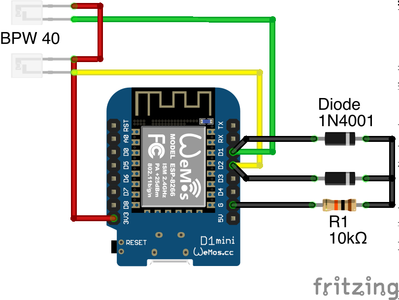

# SMcounter - Power meter for SmartMeters

This is a sensor setup measures your current power usage, if you have a smartmeter installed. It uses the IR output of the smartmeter, which in most cases outputs 10.000 blinks per kWh. It does not read the SML output for which you would need a pin code to activate in your smartmeter.

This code works on an ESP8266, but should work with compatible chipsets.

If you experience jumps and small runaways in the measurements you should try different digital pins. Good pins to use are D1, D2, D5, D6, D7 and maybe more, but your milage my vary.

## Circuit

 

## BOM

- ESP8266 or compatible, I use a Wemos D1 mini
- 2x phototransistor BPW 40
- 1x 1k or 10k resistor, different values should work
- 2x generic rectifiers

## Acknowledgements

### Third party libraries

- [NTPClient](https://github.com/arduino-libraries/NTPClient)
- [ESP8266WiFi](https://github.com/ekstrand/ESP8266wifi)
- [PubSubClient](https://github.com/knolleary/pubsubclient)
